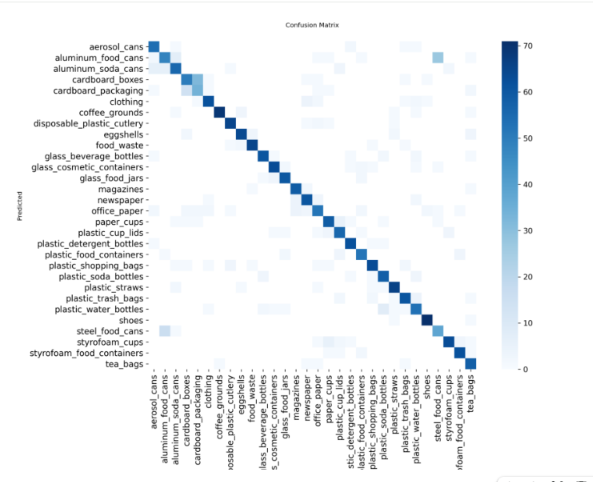
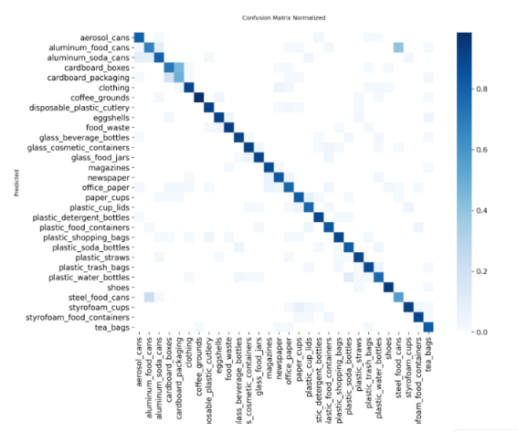

# Smart Waste Segregation System ♻️

An AI-driven waste segregation system: upload a photo of a waste item, and the
app identifies the specific item (30 categories, e.g. "plastic water bottle",
"cardboard box", "aerosol can") using a fine-tuned YOLOv8 classification
model, then maps it to a practical disposal category — recyclable, organic,
non-recyclable, or hazardous — with a disposal tip.

## Pipeline overview

1. **Dataset**: [Recyclable and Household Waste Classification Dataset](https://www.kaggle.com/datasets/alistairking/recyclable-and-household-waste-classification)
   (Alistair King, Kaggle) — 15,000 images, 30 classes, split across
   studio-quality and real-world photo subsets.
2. **Preprocessing**: `prepare_dataset.py` downloads the dataset and
   reorganizes it into `train/val/test` folders per class (70/15/15 split).
3. **Model**: `train.py` fine-tunes `yolov8n-cls` (YOLOv8 classification
   mode) on the prepared dataset.
4. **Category mapping**: `category_mapping.py` maps each of the 30 item
   classes to a disposal category (recyclable / organic / non-recyclable /
   hazardous), based on common recycling guidance.
5. **Web app**: `app.py` is a Streamlit app — upload an image, get the
   predicted item + disposal category + tip, in real time.

## Results

| Metric | Score |
|---|---|
| Top-1 accuracy (exact item) | 83.7% |
| Top-5 accuracy | 98.1% |
| **Category-level accuracy** (correct bin, even if item is off) | **94.7%** |
| Inference speed | 0.4–0.8 ms/image |
| Model size | 3.0 MB (YOLOv8n-cls, 1.47M params) |

**Why two accuracy numbers?** Standard top-1 accuracy treats every mistake
equally — but for this use case, mistaking `aluminum_food_cans` for
`steel_food_cans` is harmless (both are recyclable), while mistaking
something hazardous for recyclable is not. Category-level accuracy measures
how often the model gives the *correct disposal instruction*, regardless of
whether it named the exact item correctly. The confusion matrix (below)
confirms the model's errors stay within material types (metal↔metal,
cardboard↔cardboard) rather than crossing disposal categories.

### Confusion matrix




## Dataset details

- 15,000 images, 256×256px, 30 classes, 500 images/class
- Each class includes a `default` (studio) and `real_world` subset — merged
  during preprocessing so the model generalizes beyond clean product shots
- Split used: 6,838 train / 2,085 val / 2,098 test (70/15/15)

## Training setup

- Model: YOLOv8n-cls (Ultralytics)
- Hardware: Tesla T4 GPU (Google Colab)
- 21 epochs run, early-stopped at epoch 16 (patience=5)
- Training time: ~18 minutes

## Setup

```bash
pip install -r requirements.txt
```

You'll need a Kaggle API token (`kaggle.json`) placed in `~/.kaggle/` to
download the dataset. See: https://www.kaggle.com/docs/api

## Usage

```bash
# 1. Download and organize the dataset
python prepare_dataset.py

# 2. Train the model (produces runs/waste_cls/weights/best.pt)
python train.py

# 3. Evaluate (optional — confusion matrix + category-level accuracy)
python confusion_matrix_viz.py
python category_level_accuracy.py

# 4. Launch the web app
streamlit run app.py
```

A pretrained `best.pt` is already included in `runs/waste_cls/weights/`, so
you can skip straight to step 4 to try the app without retraining.

## Project structure

```
.
├── app.py                       # Streamlit web app
├── category_mapping.py          # 30 classes -> disposal category mapping
├── prepare_dataset.py           # Dataset download + train/val/test split
├── train.py                     # YOLOv8-cls training script
├── confusion_matrix_viz.py      # Confusion matrix analysis
├── category_level_accuracy.py   # Category-level accuracy metric
├── requirements.txt
├── results/                     # Confusion matrix images
└── runs/waste_cls/weights/      # Trained model weights (best.pt)
```

## Notes

- Disposal categories follow general recycling guidance and may vary by
  local municipality — the app includes this caveat for users.
- Built by combining ideas from existing open-source YOLOv8 + Streamlit
  waste-classification patterns with this specific dataset and a
  custom category-mapping + category-level evaluation layer.
